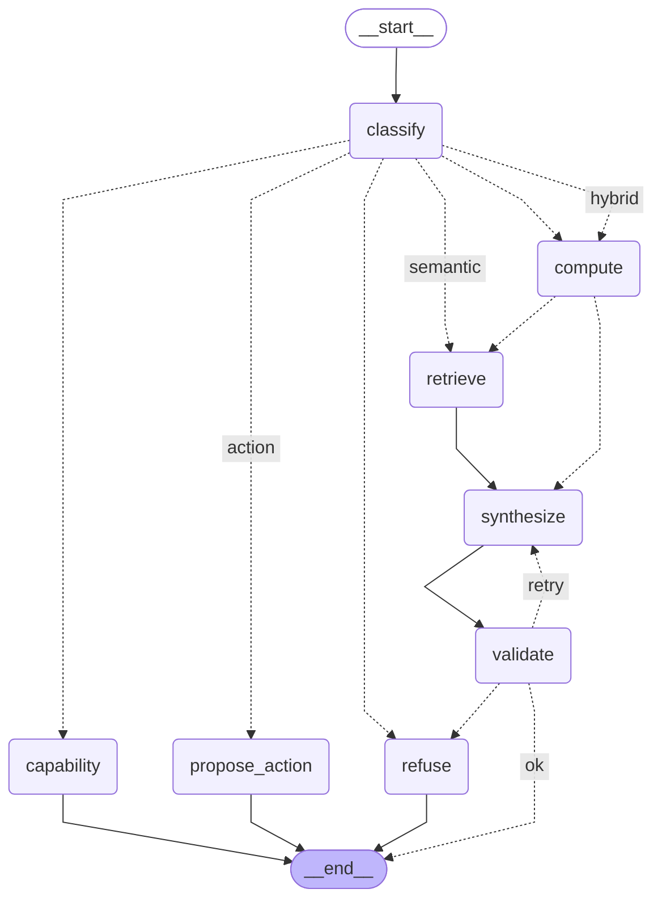

# Wealth Vault — AI Engineering Features

Five load-bearing AI capabilities built on the existing FastAPI + Postgres + Next.js stack.
Each is designed to be defended in an interview — the design decision and its tradeoff are
called out below.

## The capabilities

| # | Capability | Where | Decision to defend |
|---|-----------|-------|--------------------|
| 1 | **RAG** over the user's data | `app/services/retrieval.py`, `app/scripts/embed_backfill.py` | Hybrid: RAG is the *semantic arm only*; exact numbers come from typed tools, never from embedded text. Avoids confidently-wrong figures. |
| 2 | **pgvector + embeddings** | migrations `b1pgvec`/`b2embed`, `app/modules/rag/models.py`, `app/services/embeddings.py` | One datastore (vectors beside source rows), HNSW + `vector_cosine_ops`, `text-embedding-3-small`. No separate ANN store at this scale. |
| 3 | **LangGraph agent** | `app/modules/agent/` | Explicit `StateGraph` with a router conditional (compute/semantic/hybrid/refuse) **and a real validation cycle**. LangGraph over CrewAI: this is a control-flow problem (inspectable state + branching + a loop), not multi-role collaboration. |
| 4 | **Evals in CI** | `evals/`, `tests/`, `.github/workflows/agent-evals.yml` | Promptfoo hits the **real HTTP endpoint**; deterministic JS assertions on structured fields (exact number / refusal / cited ids). A failing assertion blocks the PR. |
| 5 | **Streaming + TTFT** | `app/modules/agent/graph.py` (`astream_agent`), `frontend/hooks/useAgentStream.ts` | SSE maps LangGraph `astream_events` → `status`/`token`/`done`. Surfaces graph steps *and* makes TTFT measurable (server + client). |

## Measured results (local run — Postgres 13 + pgvector 0.8.3, gpt-4o-mini)

- **Evals**: Promptfoo **8/8 (100%)** against the live `/api/v1/agent/query` endpoint —
  exact numbers (dining `$76.50`, groceries `$140.95`, net worth `$23,820.50`, subscriptions
  `$74.97`, income `$34,600`), the semantic "biggest purchase" (MacBook, with citations), and
  both refusals. Compute-tool pytest: **9/9**.
- **TTFT (5 questions, p50)**:
  | | p50 |
  |---|---|
  | BEFORE — `/query`, full answer | ~2507 ms |
  | AFTER — `/stream`, first token | ~2276 ms (~1.1×) |
  | AFTER — `/stream`, first *status* ("Routing…") | **~20 ms (~125×)** |

  The honest read: token-streaming alone is a modest TTFT win because routing + retrieval +
  compute happen *before* generation. The large perceived-latency win comes from surfacing
  the graph's intermediate steps as `status` events — feedback in ~20 ms vs ~2.5 s.

## The agent graph

This diagram is generated from the compiled `StateGraph` itself
(`python -m app.scripts.draw_graph --write`), so it can't drift from the code. Dotted edges are
conditional (router + validation), solid edges are fixed.

<!-- BEGIN:agent-graph — generated by `python -m app.scripts.draw_graph --write`; do not edit by hand -->

<!-- END:agent-graph -->

- **classify** — `gpt-4o-mini` structured output picks the route + which typed tools to call
  (it never writes SQL).
- **compute** — typed, parameterized, user-scoped tools (`app/modules/agent/tools.py`) return
  EXACT aggregates + the `cited_ids` of rows used. This is the answer to "why not text-to-SQL":
  safety (no cross-tenant reads, no injection) and correctness (deterministic, unit-tested).
- **retrieve** — pgvector cosine search scoped to the user (`WHERE user_id = …`).
- **synthesize** — `gpt-4o-mini`, streamed; grounded strictly in the evidence.
- **validate** — *no LLM*: deterministic numeric-grounding + sufficiency checks. On an
  ungrounded number it loops back to re-synthesize (once), else refuses.
- **capability** — answers "what can you do?" from a static catalog (no LLM, no DB).
- **propose_action** — `gpt-4o-mini` drafts a typed write (create/update/delete) for the user to
  confirm via `POST /api/v1/agent/actions/confirm`; the graph never mutates data itself.

Open it interactively in **LangGraph Studio**: `pip install -r requirements-dev.txt` then
`langgraph dev` from `backend/` (uses the committed `langgraph.json`; needs the dev DB up and
`OPENAI_API_KEY` to run questions through it).

## Why no new infra
- **No queue for embeddings** — a personal user's data is a handful of rows per action;
  embedding is synchronous in the backfill. The existing Celery stack is intentionally not used.
- **No dedicated vector DB** — pgvector in the existing Postgres; transactional consistency with
  the source rows and trivial per-tenant filtering.
- **No MCP server** — out of scope by design.

---

## Local setup & run (verified on macOS, Postgres 13 + pgvector 0.8.3)

> The codebase needs **Python 3.11** (`str | None` syntax). pgvector must be built for the
> running Postgres major (`make … PG_CONFIG=…/postgresql@13/bin/pg_config && make install`).

```bash
# 0. env (point at a dev database; OPENAI_API_KEY in backend/.env or the shell)
export DATABASE_URL='postgresql+asyncpg://localhost:5432/wealth_vault_ai'
export SECRET_KEY='dev-secret-key-min-1-char'
export PYTHONPATH=.

# 1. schema: legacy tables via create_all, incremental (monobank + pgvector) via alembic
python create_all_tables.py
alembic upgrade head

# 2. seed deterministic demo data (prints the GROUND TRUTH the evals assert on)
python -m app.scripts.seed_demo_data

# 3. fast key-free gate: the compute arm against ground truth
python -m pytest tests/ -q

# 4. embed the data into pgvector  (needs OPENAI_API_KEY)
python -m app.scripts.embed_backfill

# 5. smoke the agent across every branch  (needs OPENAI_API_KEY)
python -m app.scripts.agent_smoke

# 6. run the API, then the evals + TTFT benchmark
uvicorn app.main:app --port 8000
export AGENT_TOKEN=$(python -m app.scripts.make_demo_token)
( cd evals && AGENT_BASE_URL=http://localhost:8000 npx promptfoo eval )
AGENT_BASE_URL=http://localhost:8000 python -m app.scripts.bench_ttft   # TTFT before vs after
```

Frontend: the streaming UI lives at **`/dashboard/ask`** (`components/agent/ask-your-finances.tsx`),
consuming `/api/v1/agent/stream` via `hooks/useAgentStream.ts`.

## CI
`.github/workflows/agent-evals.yml` spins up `pgvector/pgvector:pg16`, bootstraps + seeds, runs
the compute-tool tests (key-free), backfills embeddings, starts the API, and runs the Promptfoo
gate. Needs the `OPENAI_API_KEY` repo secret.
